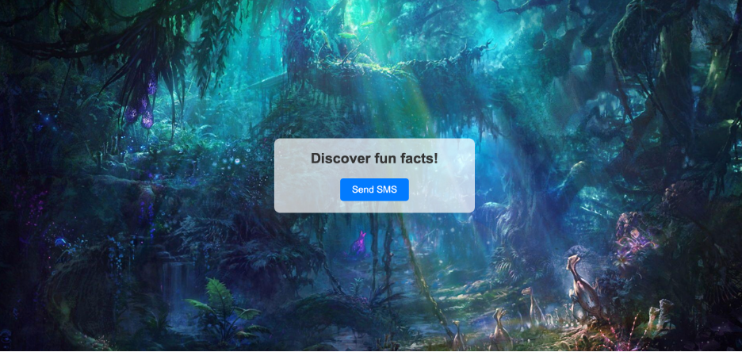
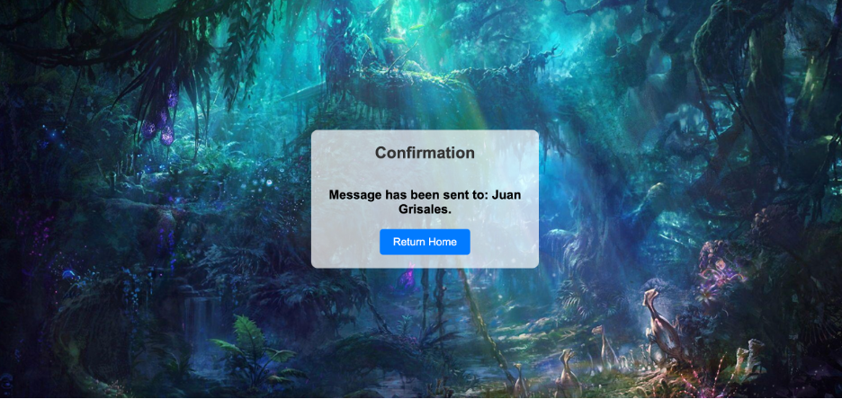
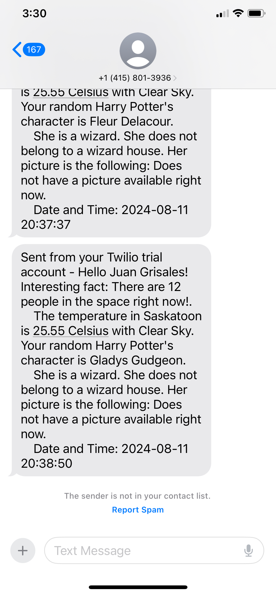

# 
 Flask App with Weather, Space Info, Harry Potter Characters, and Twilio SMS 

## Introduction & Context
This project is a Flask-based web application designed to send SMS messages with real-time weather updates, information about people currently in space, and a random Harry Potter character's details. The application integrates multiple APIs to gather the required data and presents a user-friendly interface to manage and send these updates.

## Flow of the Data Architecture
The application's data architecture revolves around API integrations:

1. **Weather Data**: Utilizes the OpenWeatherMap API to fetch current weather conditions based on the user's location. See [OpenWeatherMap API](https://openweathermap.org/api)
2. **Space Data**: Accesses the Open Notify API to retrieve the number of people currently in space and their details. See [Open Notify API](http://api.open-notify.org/)
3. **Harry Potter Character Data**: Fetches random Harry Potter character details using a custom API or dataset. See [Harry Potter API](https://hp-api.herokuapp.com/)
4. **Message Logging**: Each SMS sent is logged into a text file (`messages.txt`) for record-keeping. The log includes the recipient's name, the weather update, space information, Harry Potter character details, and the timestamp. 

The data is gathered when the user interacts with the Flask application, and it is then processed and sent via SMS using the Twilio API. The data flow is as follows:

- **User Request**: The user initiates a request by interacting with the Flask app.
- **Data Gathering**: The application makes API calls to the Weather, Space, and Harry Potter APIs to retrieve the latest information.
- **Data Processing**: The data is formatted and prepared for sending.
- **SMS Dispatch**: Using the Twilio API, the processed information is sent to the user's mobile phone as an SMS. See [Twilio API](https://www.twilio.com/)

[Check this project on Replit](https://replit.com/@grisales1803/Assignment6ConnectedData)

## Conclusions

This project demonstrates the potential of integrating multiple APIs within a single application to provide diverse information in a simple and accessible format. By using Flask as the web framework, the application is lightweight and easily deployable. The use of SMS ensures that the information reaches users in a convenient and direct manner, highlighting the power of modern web technologies in creating engaging user experiences. Additionally, the application logs every message sent into a text file (messages.txt), ensuring that all communications are recorded for future reference. This logging feature not only provides a complete history of interactions but also adds a layer of transparency and reliability to the application.

## Screenshot of the Webpage

## Screenshot of the SMS

